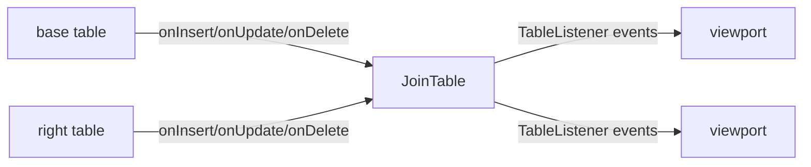
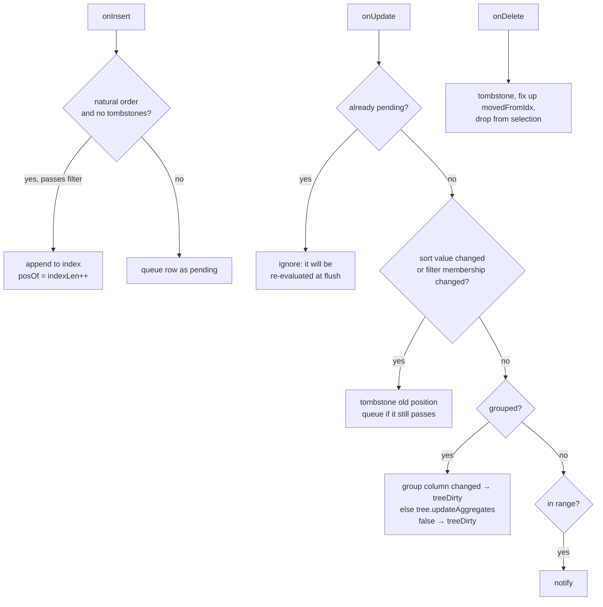
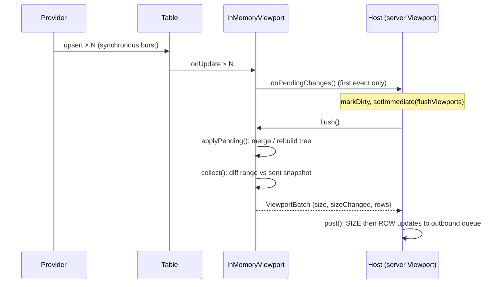

# Data engine internals

This guide explains how `@heswell/vuu-table` and `@heswell/vuu-viewport` work
internally, and how `packages/vuu-server` hosts them. For a shorter overview,
the benchmark results and the motivation, see
[data-engine.md](./data-engine.md).

It is aimed at anyone who needs to change the engine, debug it, or write an
alternative `ViewportEngine`, for example one backed by DuckDB.

## Contents

1. [Design principles](#1-design-principles)
2. [Package layout and dependencies](#2-package-layout-and-dependencies)
3. [Table](#3-table)
4. [JoinTable](#4-jointable)
5. [Viewport engine contract](#5-viewport-engine-contract)
6. [InMemoryViewport state](#6-inmemoryviewport-state)
7. [Handling table events](#7-handling-table-events)
8. [Batching and the flush lifecycle](#8-batching-and-the-flush-lifecycle)
9. [Sorting](#9-sorting)
10. [Merging pending rows](#10-merging-pending-rows)
11. [Filtering](#11-filtering)
12. [Configuration changes](#12-configuration-changes)
13. [Grouping and aggregation](#13-grouping-and-aggregation)
14. [Selection](#14-selection)
15. [Producing client updates](#15-producing-client-updates)
16. [Protocol row format and vuu-ui client expectations](#16-protocol-row-format-and-vuu-ui-client-expectations)
17. [Server integration](#17-server-integration)
18. [Hosting in the browser](#18-hosting-in-the-browser)
19. [Complexity summary](#19-complexity-summary)
20. [Writing an alternative engine](#20-writing-an-alternative-engine)
21. [Testing and benchmarks](#21-testing-and-benchmarks)
22. [Known limitations and future work](#22-known-limitations-and-future-work)

---

## 1. Design principles

- **Runtime agnostic.** The two packages use only ECMAScript built-ins: no
  Node, Bun or DOM APIs, no timers and no I/O. The host decides when work
  happens (see [§8](#8-batching-and-the-flush-lifecycle)).
- **Rows are referenced by integer position.** Tables store rows in a dense
  array. Viewports never copy rows; they keep `Int32Array` indexes of row
  positions. Sorting, filtering and merging work on integers and typed
  arrays, not objects.
- **Pay for what the client can see.** Table events are cheap to absorb. Work
  is deferred until flush, coalesced across bursts of updates, and the
  client is only sent rows within its window that actually changed.
- **Incremental where it is cheap, rebuild where it is simpler.** Inserts and
  re-sorted updates are merged into the existing sorted index. Group trees
  are rebuilt when their structure changes (`O(n·depth)`), but aggregate
  ticks are applied incrementally.
- **A swappable engine.** Everything the server needs from the analytics layer
  is behind the `DataEngine` / `ViewportEngine` interfaces
  ([§5](#5-viewport-engine-contract)).
- **Scala parity is not a goal.** The Vuu Scala server inspired the protocol
  behaviour, but the internals are designed for the JS runtime.

## 2. Package layout and dependencies

```
packages/
  vuu-table/          @heswell/vuu-table
    src/types.ts      RowSource, TableListener, TableSchema, ColumnMap
    src/Table.ts      row store
    src/JoinTable.ts  materialized left outer join
  vuu-viewport/       @heswell/vuu-viewport  (depends on vuu-table)
    src/types.ts      ViewportEngine, DataEngine, ViewportBatch, ...
    src/sort.ts       sort spec, key extraction, sortIndex
    src/filter.ts     filter compiler, filterNarrows
    src/GroupTree.ts  group tree and aggregates
    src/InMemoryViewport.ts  default engine (inMemoryDataEngine)
  vuu-server/         hosts both packages
    src/core/table/   DataTable / JoinTable subclasses (TableDef, providers)
    src/viewport/Viewport.ts  protocol wrapper, flush scheduler, visual links
  benchmarks/         performance scenarios, per engine adapter
```

The only external runtime dependencies are `@vuu-ui/vuu-protocol-types`
(types only) and `@vuu-ui/vuu-filter-parser` (parses filter query strings).

## 3. Table

`Table` (`vuu-table/src/Table.ts`) is a keyed row store.

### Storage

| Field       | Type                  | Purpose                                       |
| ----------- | --------------------- | --------------------------------------------- |
| `rows`      | `VuuDataRow[]`        | dense array of rows (arrays of column values) |
| `seq`       | `number[]`            | insertion sequence number, parallel to `rows` |
| `#index`    | `Map<string, number>` | key column value → row position               |
| `columnMap` | `ColumnMap`           | column name → column position in a row        |

A row is a plain array whose positions match `schema.columns`. The key
column's position is `indexOfKeyField`.

`seq` gives the "natural order" of a table without a sort. It is also the
final tie-breaker for every sort, which makes sort order a **total order**
([§9](#9-sorting)). Viewports rely on this to binary-search and merge
deterministically.

### Operations

| Operation               | Behaviour                                                                                                                                                                                |
| ----------------------- | ---------------------------------------------------------------------------------------------------------------------------------------------------------------------------------------- |
| `insert(row)`           | Appends the row and assigns the next `seq`. If the key already exists, it becomes an `update`. Fills `vuuCreatedTimestamp` / `vuuUpdatedTimestamp` if those columns exist and are empty. |
| `update(rowIdx, row)`   | Replaces the row and sets `vuuUpdatedTimestamp`. Notifies `onUpdate(rowIdx, row, previous)`.                                                                                             |
| `updateByKey(key, ...)` | Copies the existing row, applies the changes, then calls `update`. `previous` is therefore always a distinct array.                                                                      |
| `upsert(row)`           | Insert or update by key.                                                                                                                                                                 |
| `delete(key)`           | **Swap-remove**: the last row moves into the deleted slot. Notifies `onDelete(rowIdx, row, movedFromIdx)`.                                                                               |

Swap-remove keeps `rows` dense and makes deletion `O(1)`, at a cost: a
deletion **changes the position of one other row**. That is why `onDelete`
carries `movedFromIdx`. Every listener that holds row positions must
rewrite `movedFromIdx` → `rowIdx` (see [§7](#7-handling-table-events)).
`movedFromIdx === rowIdx` when the last row itself was deleted.

### Listener contract

```ts
interface TableListener {
  onInsert(rowIdx: number, row: VuuDataRow): void;
  onUpdate(rowIdx: number, row: VuuDataRow, previous: VuuDataRow): void;
  onDelete(rowIdx: number, row: VuuDataRow, movedFromIdx: number): void;
  onClear?(): void;
}
```

- Listeners are notified synchronously, in registration order, on every
  change. The legacy `emitEvent` flag is accepted for compatibility but
  ignored: a viewport cannot be correct if it misses events.
- An **in-place update** is signalled with `previous === row`. This happens
  when a provider mutates a row array directly. The listener cannot tell
  which columns changed and must assume any of them did.
- Listeners must be cheap. A table with 50 viewports calls 50 `onUpdate`
  callbacks per tick, so viewports only record what happened
  ([§7](#7-handling-table-events)).

`onClear` is sent by `Table.clear()`; a viewport responds by emptying its
index, pending state and selection.

`RowSource` is the read-only side of the contract (`rows`, `seq`/`seqAt`,
`columnMap`, `indexOfKeyField`, `schema`, `rowCount`, `rowIndexAtKey(key)`,
`addListener`, `removeListener`). Viewports depend only on `RowSource`, so anything that
implements it, including `JoinTable`, can be viewed.

## 4. JoinTable

`JoinTable` (`vuu-table/src/JoinTable.ts`) extends `Table` and holds a
**materialized left outer join** of a base table and a right table.
Viewports over a join are therefore exactly as cheap as viewports over a
simple table: there is no per-read join.



### Column resolution

For each join column, the constructor resolves a source once: the base
table's column if it has one with that name (base wins), otherwise the right
table's. A join row is built by reading each source position directly. A
right-side value is `null` when no right row matches.

The join row key is the base row key.

### Indexes

| Index                  | Maps                            | Used when                                                    |
| ---------------------- | ------------------------------- | ------------------------------------------------------------ |
| `#baseKeysByJoinValue` | join value → `Set` of base keys | a right row changes: find every base row that references it  |
| `#rightKeyByJoinValue` | join value → right key          | only if the right join column is **not** the right table key |

When the right join column is the right table's key (the usual case, e.g.
`ric`), the lookup is simply `rightTable.rowIndexAtKey(value)`.

### Event propagation

| Event               | Join action                                                                                                                                                                                 |
| ------------------- | ------------------------------------------------------------------------------------------------------------------------------------------------------------------------------------------- |
| base insert         | Build the join row and `insert` it. Index the base key under its join value.                                                                                                                |
| base update         | Rebuild the join row and `update` it. If the join value changed, move the base key between index sets.                                                                                      |
| base delete         | Delete the join row and unindex it.                                                                                                                                                         |
| right insert/update | For every base key under that join value, rebuild and `update` the join row.                                                                                                                |
| right delete        | Same, with right columns set to `null`. With a non-key right column, `unindexRightRow` rescans the right table for another row with the same join value, so that a duplicate can take over. |

Join rows are rebuilt and replaced, never mutated, so downstream listeners
always get a distinct `previous`.

The join is **read-only** from outside: `insert`/`upsert` throw. `destroy()`
removes the listeners from both source tables.

The server's `JoinTable` (`vuu-server/src/core/table/JoinTable.ts`)
subclasses this and adds the `TableDef`, a provider slot and a
`ColumnValueProvider`.

## 5. Viewport engine contract

`vuu-viewport/src/types.ts` defines the swap point:

```ts
interface DataEngine {
  readonly name: string;
  createViewport(table: RowSource, options: ViewportOptions): ViewportEngine;
}
```

A `ViewportEngine` owns everything that is specific to one client view:
config (columns, sort, filter, groupBy, aggregations), range, selection,
permission and link filters, and tree expansion state. Every method that can
change what the client sees returns a `ViewportBatch`:

```ts
interface ViewportBatch {
  size: number; // total rows (or visible tree rows)
  sizeChanged: boolean; // size differs from the last batch
  rows: ViewportRow[]; // changed rows within the range only
}
interface ViewportRow {
  rowIndex: number; // position in the viewport
  rowKey: string; // table key, or tree key when grouped
  sel: 0 | 1;
  data: VuuRowDataItemType[]; // projected columns (+ 6 tree columns if grouped)
}
```

Rules every engine must follow:

1. `rows` holds only positions inside the current range whose content or
   selection state has changed since they were last returned (`getCurrentRange`
   is the exception: it returns everything).
2. Table events must not be processed eagerly beyond bookkeeping. Call
   `onPendingChanges` (at most once between flushes) and do the work in
   `flush()`.
3. No runtime-specific APIs.

## 6. InMemoryViewport state

`InMemoryViewport` is the default engine (`inMemoryDataEngine`). It
registers itself as a `TableListener` on construction.

| Field                              | Type                        | Meaning                                                                                            |
| ---------------------------------- | --------------------------- | -------------------------------------------------------------------------------------------------- |
| `#index`, `#indexLen`              | `Int32Array`, `number`      | Filtered and sorted row positions. May contain tombstones (`-1`).                                  |
| `#posOf`                           | `Int32Array`                | Row position → position in `#index`, or `-1`. Sized to the table, grown on demand.                 |
| `#tombstones`                      | `number`                    | Count of `-1` entries in `#index`.                                                                 |
| `#pendingFlag`, `#pendingList`     | `Uint8Array`, `number[]`    | Rows waiting to be (re)positioned at the next flush. The flag dedupes them.                        |
| `#forceDirty`                      | `Set<number>`               | Rows updated in place. These must be resent even if the row reference is unchanged.                |
| `#scratch`                         | `Int32Array`                | Double buffer for merges: swapped with `#index`, never reallocated per flush.                      |
| `#sortSpec`, `#compare`            | `SortSpec`, comparator      | Resolved sort columns/directions and a row comparator (`seq` tie-break).                           |
| `#predicate`                       | `RowPredicate \| undefined` | Composite of permission, link and client filters ([§11](#11-filtering)); `undefined` = accept all. |
| `#tree`                            | `GroupTree \| undefined`    | Present when `groupBy` is non-empty.                                                               |
| `#treeDirty`, `#flattenDirty`      | `boolean`                   | Tree needs a rebuild, or only re-flattening (open/close).                                          |
| `#selected`                        | `Set<string>`               | Selected keys (table keys when flat, tree keys when grouped).                                      |
| `#sentKey`, `#sentRef`, `#sentSel` | arrays                      | Snapshot of what the client holds for each range position ([§15](#15-producing-client-updates)).   |
| `#size`, `#lastSentSize`           | `number`                    | Current and last-reported size.                                                                    |
| `#notified`                        | `boolean`                   | `onPendingChanges` has been called since the last flush.                                           |

### Invariants

- If `posOf[r] = p ≥ 0` then `index[p] = r`. Every live row in the index
  satisfies the predicate.
- Live (non-tombstone) entries of `index[0, indexLen)` are in strictly
  increasing order of `(sort columns…, seq)`.
- A row is in at most one of: the index (`posOf ≥ 0`) or the pending list.
  A row that has been tombstoned and queued has `posOf = -1`.
- `size` excludes tombstones: `indexLen - tombstones` when flat, or
  `tree.visible.length` when grouped. Tombstones are always cleared by the
  end of a flush, so the client never sees a gap.

## 7. Handling table events

Listeners only do bookkeeping. They never sort, merge or build anything.



### `onInsert(rowIdx, row)`

- **Natural order, no tombstones:** a new row has the largest `seq`, so it
  belongs at the end. If it passes the predicate it is appended directly
  (`O(1)`).
- **Otherwise:** set `pendingFlag[rowIdx]` and push it to `pendingList`. The
  predicate is evaluated later, so a burst of inserts costs nothing until
  the flush.

### `onUpdate(rowIdx, row, previous)`

1. If the row is already pending, return. Its position is recomputed at the
   flush.
2. **Sort change:** compare `row[col]` with `previous[col]` for each sort
   column. An in-place update (`previous === row`) is assumed to change the
   sort, and the row is added to `#forceDirty`.
3. **Filter membership:** `wasIn = posOf[rowIdx] >= 0`, `isIn = predicate(row)`.
4. If the sort changed, or `wasIn !== isIn`: tombstone the old position (if
   any) and queue the row if `isIn`. Then notify.
5. Otherwise the row stays where it is:
   - **Grouped:** if a groupBy column changed, the row moves to another group,
     so set `#treeDirty`. Otherwise call `tree.updateAggregates(rowIdx, previous, row)`.
     A `false` return (e.g. the current HIGH value was lowered) also sets
     `#treeDirty`. Notify.
   - **Flat:** notify only if the row's position is inside the range. A tick
     on a row the client cannot see costs a handful of comparisons.

### `onDelete(rowIdx, row, movedFromIdx)`

1. Tombstone `rowIdx` if it is indexed; clear its pending and force-dirty
   state.
2. **Fix up the moved row.** The table moved row `movedFromIdx` into slot
   `rowIdx`, so:
   - `posOf[rowIdx] = posOf[movedFromIdx]` and `index[thatPos] = rowIdx`;
   - move the `pendingFlag` and `forceDirty` entries the same way.
3. Remove the deleted key from `#selected`. If the selection changed, call
   `onSelectionChange` so that visual links update.
4. Notify, if the deleted row was in the index.

### Tombstones

Removing an entry from the middle of an `Int32Array` is `O(n)`. Instead the
slot is set to `-1` and counted. Tombstones are cleared in bulk by the next
merge ([§10](#10-merging-pending-rows)), so a burst of _k_ deletions costs
`O(k)` plus one `O(n)` pass, not `O(k·n)`.

## 8. Batching and the flush lifecycle



- `notify()` calls `onPendingChanges` only if `#notified` is false. It is
  reset at the start of `applyPending`, so a burst of 10,000 ticks produces
  one callback.
- `flush()` = `applyPending()` + `collect()`.
- `applyPending()`:
  1. If there are pending rows or tombstones, `mergePending()`. When grouped,
     this also sets `#treeDirty`.
  2. If `#treeDirty`: `tree.build(index, indexLen)`, `tree.sortGroups(sortDefs)`,
     `tree.flatten()`.
  3. Else if `#flattenDirty`: `tree.flatten()`.
  4. Recompute `size`.
- Every public method that returns a batch (`setRange`, `setConfig`,
  `openTreeNode`, `selectRow`, …) calls `applyPending()` first, so
  responses always reflect the latest table state.

The host chooses the batching policy. The server uses `setImmediate` (see
[§17](#17-server-integration)). A browser host could use
`queueMicrotask` or `requestAnimationFrame`, and a test can call `flush()`
directly.

## 9. Sorting

`sort.ts` turns a `VuuSort` into a `SortSpec`
(`columns: number[], directions: (1|-1)[]`) once, at config time.

### Ordering rules

- Sort columns in order, then `seq` ascending as the final tie-break. This
  makes the order **total**: no two rows compare equal, which is required by
  the binary-search merge.
- `null` / `undefined` sort first (ascending).
- Strings compare by code unit (`<`), not locale. This is deliberate: it is
  several times faster than `localeCompare` and is stable across runtimes.

### `sortIndex(index, len, table, spec)`

A full sort of _n_ indices with a generic comparator would do
`O(n log n)` row lookups and value comparisons with type checks. Instead:

1. **Key extraction:** for each sort column, `extractKeys` builds a
   `Float64Array` indexed by row position:
   - numbers are used as is; booleans become 0/1; null/undefined become
     `-Infinity`;
   - strings are **rank encoded**: collect the distinct values, sort them
     once, and give each row the rank of its value. For a currency column
     that is a sort of ~10 strings, not of 1M.
   - a column that mixes strings and numbers (or holds objects) returns
     `undefined`, and `sortIndex` falls back to `createComparator`.
2. **Specialized comparators** for 1, 2 and _N_ keys, e.g. for one ascending
   key: `(a, b) => k0[a] - k0[b] || seq[a] - seq[b]`. These are monomorphic,
   allocation-free closures over typed arrays, which JIT very well.
   (`-Infinity - -Infinity` is `NaN`, which is falsy, so equal null keys
   correctly fall through to the next key.)
3. `Int32Array.prototype.sort` sorts in place, with no boxing.

Measured on 1M rows (create view, including the initial scan): sort by price
takes ~275 ms; ccy + price takes ~390 ms, down from ~970 ms with the generic
comparator.

`createComparator` (a generic row comparator that uses the same rules) is
still used for incremental work, where only a few comparisons are needed:
the binary search and linear merge in `mergePending`.

## 10. Merging pending rows

`mergePending()` turns `index + tombstones + pendingList` back into a clean
sorted index.

1. **Collect:** keep the pending rows that are still flagged, still exist,
   are not already indexed (`posOf === -1`) and pass the predicate. Clear
   their flags.
2. **Sort** that pending batch with `sortIndex` (usually tiny).
3. **Choose a strategy.** With `liveLen = indexLen - tombstones` and
   `k = pendingLen`:
   - **Binary search** if `k · log2(liveLen + 2) < liveLen`. Compact the
     tombstones out first, then for each pending row (in sorted order)
     binary-search its insertion point in the live index (`compare ≤ 0` →
     `lo = mid + 1`, starting from the previous insertion point). Block-copy
     the runs between insertion points into `#scratch` with
     `Int32Array.set`/`copyWithin`. Cost: `O(k log n)` comparisons plus a
     `memcpy` of _n_ integers.
   - **Linear merge** otherwise: a classic two-way merge of the old index
     (skipping `-1`) and the pending batch. Cost: `O(n + k)` comparisons.
4. Swap `#index` ↔ `#scratch`, set `indexLen`, zero `tombstones` and
   rebuild `posOf` for the merged range.

A typical tick flush (a few hundred re-sorted rows out of 1M) therefore
costs roughly one copy of the index, not a re-sort. Because the order is
total, the binary search places every row at a single, deterministic
position, which keeps the result identical to a full `sortIndex`. The
randomized consistency tests check exactly this.

In natural order (no sort), the comparator is just `seq`, so the same code
handles re-inserting rows that were filtered out and then back in.

## 11. Filtering

### Compilation (`filter.ts`)

`parseAndCompileFilter(query, columnMap)` parses a Vuu filter string with
`@vuu-ui/vuu-filter-parser` and then `compileFilter` turns the AST into a
closure tree:

- column positions and literal values are resolved **once**;
- `and`/`or` with two children become `(r) => p1(r) && p2(r)`, and with _n_
  children a loop over an array of predicates;
- `in` uses a `Set` (`O(1)` per row);
- `starts`/`ends`/`contains` lower-case the pattern once and match strings
  only;
- `{ asLong }` values are unwrapped;
- an unknown column, an unsupported op or a parse error compiles to
  `rejectAll` (with a warning) rather than throwing. The viewport then shows
  no rows.

An empty query compiles to `undefined` (no client filter).

### Predicate composition

The effective predicate is the AND of up to four parts, in this order:

| Part       | Set by                                                     | Source                                                                                           |
| ---------- | ---------------------------------------------------------- | ------------------------------------------------------------------------------------------------ |
| permission | `setPermissionFilter(predicate)`                           | `TableDef.permissionFunction` → `PermissionFilter.createPredicate(columnMap)`                    |
| link       | `setLinkFilter({column, values})`                          | visual link from a parent viewport's selection                                                   |
| base       | `setBaseFilter(filterSpec)` or the `baseFilterSpec` option | a host-imposed Vuu filter, e.g. vuu-ui's `freeze()` (`vuuCreatedTimestamp < ts`) or `baseFilter` |
| client     | `setConfig({filterSpec})`                                  | the user's filter                                                                                |

`composePredicate` skips absent parts and specialises for 1 to 4 parts.
With none, `#predicate` is `undefined` and the scan loops skip predicate
calls entirely. The link filter is `(row) => values.has(row[col])`. The parts
are kept separately, so changing one does not require re-parsing the others.

The base filter is a separate slot so that, unlike vuu-ui's `ArrayDataSource`
(where `freeze()` and visual links both write `baseFilter`), a freeze, a
visual link and the user's filter never overwrite each other. An invalid base
filter compiles to `rejectAll`, as for the client filter. The server's
`Viewport.setBaseFilter` exposes it to hosts; it is not part of the Vuu
protocol.

### Narrowing

When only the client filter changes and the sort is unchanged (or only
the base filter changes),
`filterNarrows(newFilter, oldFilter)` checks structurally whether the new
filter is the old one AND something extra (e.g. the user typed one more
clause). If so, `narrowIndex` filters the existing sorted index **in place**
(`O(n_current)`, no re-sort). Otherwise `rebuildIndex` scans the whole table
and re-sorts.

`filterNarrows` is conservative (structural equality of clauses via JSON).
A false negative only costs a rebuild; a false positive would be a bug.

## 12. Configuration changes

`setConfig(partial)` ignores keys that are `undefined`, and compares the
others with the current config by value.

| What changed                 | Action                                                                                                                     |
| ---------------------------- | -------------------------------------------------------------------------------------------------------------------------- |
| columns only                 | `bindColumns` (re-project). Rows in range are resent (snapshot reset); no index work.                                      |
| filter, narrowing, same sort | `narrowIndex`                                                                                                              |
| filter, otherwise            | `rebuildIndex`: scan all rows with the predicate, then `sortIndex`.                                                        |
| sort only                    | `resortIndex`: `sortIndex` over the current index. No re-filter.                                                           |
| groupBy / aggregations       | New `GroupTree` (or none if `groupBy` is empty). Expanded keys are kept only if `groupBy` is unchanged. Tree marked dirty. |
| filter or sort while grouped | Tree marked dirty (rebuilt from the new index).                                                                            |
| any structural change        | The sent snapshot is reset, so the whole window is resent.                                                                 |

`setPermissionFilter` and `setLinkFilter` call `refilter()`, which recomposes
the predicate and does a full `rebuildIndex`. Link filter changes are driven
by user selection and are rare relative to ticks.

All `setConfig` work happens synchronously, followed by `applyPending()` and
`collect()`, so the returned batch is the complete response to the change.

## 13. Grouping and aggregation

Grouping is layered **on top of** the flat index: the viewport always keeps
the filtered and sorted `#index`, and `GroupTree` is built from it. As a
result, leaves within a group appear in the viewport's sort order for free.

### Tree structure (`GroupTree.ts`)

```
$root                                   depth 0 (never sent)
├── $root|EUR                           depth 1  (groupBy[0] = ccy)
│   ├── $root|EUR|XLON                  depth 2  (groupBy[1] = exchange)
│   │   └── leaves: [rowIdx, rowIdx, …] depth 3 = leafDepth
│   └── $root|EUR|XPAR
└── $root|GBP
```

`GroupNode` fields:

- `key`: the tree key, `parent.key + "|" + String(value)`;
- `label`: the group value; `depth` and `parent`;
- `children` + `childMap` (value → node) for inner levels, or `leaves`
  (row positions) for the lowest group level;
- `leafCount`: the number of leaf rows beneath the node;
- `agg: Float64Array`, `aggN: Int32Array` and, for Distinct only,
  `distinct: Set[]`: one slot per aggregation;
- `version`, which is bumped when the node's aggregates change.

`nodesByKey` maps tree key → node, and `leafParent[rowIdx]` maps a leaf row
to its lowest group node. Both are used for `O(1)` lookups on update and
selection.

### Build: `O(n · depth)`

`build(index, len)` walks the sorted index once. For each row it descends
from the root, finding or creating the child for each groupBy value through
`childMap`, increments `leafCount` on the way down, appends the row to the
lowest node's `leaves`, and accumulates the row into that node's aggregates.
Afterwards a post-order `rollUp` combines the children's aggregates into
their parents, which avoids accumulating every row at every level.

Children are created in first-seen order, which is then replaced by
`sortGroups`.

### Aggregates

| Type     | `agg[i]` holds   | Value sent                | Incremental update                                                   |
| -------- | ---------------- | ------------------------- | -------------------------------------------------------------------- |
| Sum      | running sum      | `agg`                     | add `new - old` up the ancestor chain                                |
| Average  | sum (`aggN` = n) | `agg / aggN`              | add the delta to the sum and to n                                    |
| Count    | non-null count   | `agg`                     | ±1 when the value changes to or from null                            |
| High/Low | current extreme  | `agg` (or `null` if none) | raising the extreme: yes. Lowering the current extreme: **rebuild**. |
| Distinct | `Set` of values  | values joined with `,`    | **rebuild**                                                          |

Non-numeric values are ignored by Sum/Avg/High/Low (`NaN` check). Count
counts non-null values of the column.

`updateAggregates(rowIdx, previous, row)` walks from `leafParent[rowIdx]` to
the root for each aggregated column whose value changed, applies the delta,
and bumps `version`. It returns `false` when an incremental update is not
possible, and the viewport then marks the tree dirty. On a price tick with
Sum/Avg this is `O(depth)` per tick, with no rebuild.

### Group ordering: `sortGroups(sortDefs)`

For each group level the first applicable sort def decides the order:

1. If the sort column **is that level's groupBy column**, groups are ordered by
   label in that direction.
2. If the sort column **is aggregated**, groups are ordered by the aggregate
   value (the first aggregation on that column).
3. Otherwise groups are ordered by label, ascending.

Leaves keep the viewport's row sort order, because the tree was built from
the sorted index.

When groups are sorted by an aggregate, an incremental aggregate update can
change the group order, but the tree is only re-sorted when it is rebuilt.
Any structural change (insert, delete, re-sort, filter) triggers a rebuild,
so the order converges quickly. This trade-off avoids re-sorting siblings
on every tick.

### Flattening and expansion

`flatten()` produces `visible: (GroupNode | number)[]`, the rows the client
can scroll through: each child of the root, and recursively the children of
every node whose key is in `expanded` (a `Set<string>`). For an expanded
lowest-level node, its leaf row positions follow. `size` is
`visible.length`.

- `openTreeNode(key)` adds the key to `expanded` and sets `#flattenDirty`. No
  rebuild is needed.
- `closeTreeNode(key)` removes the key **and all descendant keys**
  (the `key|` prefix), so reopening a parent does not unexpectedly reveal
  deep levels.
- `expanded` survives rebuilds, because it is keyed by stable tree keys rather
  than node identity. It is discarded when `groupBy` changes.

### Cost of a tick when grouped

| Tick changes                                         | Work                                                                   |
| ---------------------------------------------------- | ---------------------------------------------------------------------- |
| aggregated column, Sum/Avg/Count, or raises the High | `O(depth)` delta, notify                                               |
| non-aggregated, non-sort, non-group column           | notify only (leaf may be visible)                                      |
| sort column, filter membership, or group column      | merge into the flat index, then rebuild the tree `O(n·depth)` on flush |

## 14. Selection

Selection is held as a `Set<string>` of keys in `#selected`.

| Mode    | Selectable keys                |
| ------- | ------------------------------ |
| flat    | table row keys                 |
| grouped | tree keys: group nodes (`$root | EUR`) and leaves (`$root | EUR | XLON | <rowKey>`) |

A leaf's tree key is `parentNode.key + "|" + rowKey`. Leaf keys therefore
start with `$root`, which the vuu-ui client relies on
([§16](#16-protocol-row-format-and-vuu-ui-client-expectations)).

- `selectRow(key, preserve)` / `deselectRow` / `deselectAll` update the set.
- `selectRowRange(from, to, preserve)` selects every key between the
  positions of `from` and `to` in the current view (flat index or
  `visible`).
- A selection change does not move rows. The next `collect()` compares
  `#sentSel` and resends only the rows whose `sel` flag flipped.
- On delete, the row's key is removed from the selection. If this changes
  the selection, `onSelectionChange` lets the host update visual links.
- `Table.clear()` (`onClear`) clears the selection. A `groupBy` change does
  not; keys from the other key space simply stop matching any row.

For visual linking and RPC handlers:

- `getSelectedRowKeys()` returns the **table** row keys. A selected group
  (looked up in `nodesByKey`) contributes every leaf row beneath it, found
  by walking its children. Selected leaves are found by scanning the
  visible rows, so only leaves under expanded groups count. When flat, the
  selected keys that still exist are returned.
- `getSelectedValues(column)` returns the distinct values of `column` over
  those rows. This is what a child viewport filters on.

### Select all

`selectAll()` puts the viewport into a **live** select-all mode, matching
vuu-ui's ArrayDataSource (`"*"`), rather than Scala's snapshot of the
current keys. The state is a `#selectAll` flag plus a `#deselected` set of
exceptions; `#selected` is not populated.

- Every row in the view is selected, including rows that enter it later
  through inserts, updates that now pass the filter, or re-inserts after a
  delete.
- `deselectRow(key, true)` adds an exception. `selectRow`/`selectRowRange`
  with `preserve` remove exceptions. A non-preserving select or deselect,
  or `deselectAll()`, leaves select-all mode.
- Exceptions persist while a row is filtered out. They are dropped when the
  row is deleted, so a re-inserted row is selected again.
- `selectedRowCount` is O(exceptions): `indexLen` minus the exceptions still
  present (flat), or the visible keys not excepted (grouped).
  `selectedKeys` and `getSelectedRowKeys()` are built on demand. When
  grouped, an excepted group excludes all leaves beneath it.
- `collect()` tests `#deselected` instead of `#selected`, so the cost per
  tick is unchanged.

The server handles `SELECT_ALL` by replying `SELECT_ALL_SUCCESS` with
`selectedRowCount`, or `SELECT_ALL_REJECT`. Linked child viewports are
refreshed when select-all is applied, but not when rows enter the parent
afterwards ([§22](#22-known-limitations-and-future-work)).

## 15. Producing client updates

`collect()` builds the `rows` of a batch by comparing the current window
with a **snapshot of what the client holds**. For each position `p` in
`[range.from, range.to)` the snapshot holds:

- `#sentKey[p]`: the row key (or tree key) last sent at `p`;
- `#sentRef[p]`: the row array (flat) or a copy of the group row data
  (grouped) last sent;
- `#sentSel[p]`: the `sel` flag last sent.

A position is emitted if:

- the key differs (a different row now occupies the position); or
- **flat:** the row reference differs (`Table.update` always replaces the
  array), or the row is in `#forceDirty` (updated in place); or
- **grouped group row:** `shallowEqual(newData, sentData)` is false (the
  aggregates, child count or expansion changed); or
- the selection flag differs.

The comparison is by reference, so it is `O(range)` per flush with no deep
compares in flat mode. A viewport whose 100-row window holds no ticking
rows emits nothing, however busy the table is.

`setRange(newRange)` copies the snapshot entries for the overlap of the old
and new ranges to their new offsets, so scrolling by one row sends one row,
not a full window. `getCurrentRange()` ignores the snapshot (used on create
and when a disabled viewport is re-enabled).

`sizeChanged` is `size !== #lastSentSize`. A batch where inserts and deletes
cancel out has no size change, and therefore no SIZE message.

## 16. Protocol row format and vuu-ui client expectations

### Flat rows

`data` is the projected column values, in the order of `config.columns`.
`rowKey` is the table key.

### Grouped rows

Six tree columns precede the projected columns:

| #   | Column     | Group row                                                                       | Leaf row             |
| --- | ---------- | ------------------------------------------------------------------------------- | -------------------- |
| 0   | depth      | `node.depth` (1 …)                                                              | `tree.leafDepth`     |
| 1   | isExpanded | `expanded.has(key)`                                                             | `false`              |
| 2   | treeKey    | `node.key`                                                                      | `parentKey           | rowKey` |
| 3   | isLeaf     | `false`                                                                         | `true`               |
| 4   | label      | `node.label`                                                                    | `rowKey`             |
| 5   | childCount | `node.childCount`                                                               | `0`                  |
| 6…  | columns    | aggregate, or group label for groupBy columns at or above this depth, else `""` | projected row values |

The `rowKey` of a grouped `ViewportRow` is the tree key.

### Client behaviour this design depends on (vuu-ui `vuu-data-remote`)

- `toClientRowTree` destructures `[depth, isExpanded, , isLeaf, , count, ...rest]`.
  The column order above must not change.
- `isLeafUpdate` drops "U" rows whose `rowKey` does not start with `$root`
  when the viewport is a tree. Leaf keys must therefore keep the
  `$root|…` prefix.
- The client sets `isTree` only when it receives `CHANGE_VP_SUCCESS`. The
  server must confirm every `CHANGE_VP`; before this refactor it did not,
  and grouping silently failed in the UI.

## 17. Server integration

`vuu-server/src/viewport/Viewport.ts` wraps a `ViewportEngine` and adapts it
to the protocol.

### Creation

`ViewportContainer` creates a `Viewport` with the table, the client's
config and range, and the default `DataEngine`
(`setDefaultDataEngine` can swap it). `columns: ["*"]` is expanded to all
schema columns. If the `TableDef` has a `permissionFunction`, it is called
with the viewport and table container, and the resulting `PermissionFilter`
is bound to the table's `columnMap` and handed to the engine as a predicate.

### Flush scheduler

```ts
const dirtyViewports = new Set<Viewport>();
onPendingChanges: () => markDirty(this);
// markDirty: add to the set; if no flush is scheduled, setImmediate(flushViewports)
```

All table updates triggered by one I/O callback (e.g. a WebSocket message
from the prices service carrying 500 updates) run synchronously, then a
single `setImmediate` flushes every dirty viewport once. `flushViewports()`
is exported so that tests can flush deterministically. `destroy()` removes
the viewport from the dirty set.

### Publishing

`post(batch)` converts a batch into `ViewPortUpdate`s on the session's
`OutboundRowPublishQueue`: one SIZE update when `sizeChanged` (or forced),
then one ROW update per row. The client connection drains the queue on its
own timer (`FlowController`, batches of 300) and serialises them as
`TABLE_ROW` messages. Request responses (`CREATE_VP_SUCCESS`,
`CHANGE_VP_SUCCESS`, …) are sent on the channel immediately, so a success
response always reaches the client before the rows it produced.

A disabled viewport (`DISABLE_VP`) publishes nothing. On re-enable it
resends the current range, because the client's cache is stale.

### Visual links

`RuntimeViewPortVisualLink` subscribes to the parent viewport's
`row-selection` event. On each selection change it calls
`parent.getSelectedValues(parentColumn)` and sets
`child.setLinkFilter({ column: childColumn, values })`. An empty selection
removes the link filter (the child is unrestricted). Removing the link
clears the child's link filter. Because the link filter is a separate part
of the predicate, the child's own client filter and permission filter are
unaffected.

### Join tables and providers

Server `DataTable`s subclass `Table`; server `JoinTable`s subclass the
materialized `JoinTable` and are wired up by `TableContainer` from
`JoinTableDef`s. Providers write to tables with `insert`/`upsert`/`delete`,
and nothing in the provider layer knows about viewports.

## 18. Hosting in the browser

Nothing in either package needs the server. A browser host:

1. Creates `Table`s (and `JoinTable`s) and feeds them from a simulator or a
   fetch.
2. Calls `inMemoryDataEngine.createViewport(table, { …config, onPendingChanges })`,
   where `onPendingChanges` schedules `flush()` with `queueMicrotask` or
   `requestAnimationFrame`.
3. Translates each `ViewportBatch` into the messages its data source emits.
   This is the replacement path for `TickingArrayDataSource` / `VuuModule` in
   `vuu-data-test`, and the batch already holds the client row format.

Visual links in the browser are the same few lines as
`RuntimeViewPortVisualLink`: listen to the parent's selection, call
`getSelectedValues`, then `setLinkFilter` on the child.

## 19. Complexity summary

_n_ = rows in the table, _m_ = rows in the viewport index, _k_ = rows changed
in a burst, _w_ = window size, _d_ = group depth, _g_ = group nodes.

| Operation                                | Cost                                             |
| ---------------------------------------- | ------------------------------------------------ |
| table insert / update / delete           | `O(1)` + `O(listeners)`                          |
| viewport event bookkeeping               | `O(sort cols)` per event                         |
| flush, nothing pending                   | `O(w)` (diff only)                               |
| flush, _k_ re-sorted rows, `k log m < m` | `O(k log k + k log m)` compares + `O(m)` copy    |
| flush, large _k_                         | `O(k log k + m + k)`                             |
| create / filter rebuild                  | `O(n)` scan + `O(m log m)` sort                  |
| narrowing filter                         | `O(m)`                                           |
| change sort                              | `O(m log m)` (dense keys)                        |
| tree build                               | `O(m·d)` + `O(g log g)` group sort               |
| aggregate tick (Sum/Avg/Count)           | `O(d)`                                           |
| open / close node                        | `O(visible)` flatten                             |
| scroll                                   | `O(w)`                                           |
| join: base event / right event           | `O(columns)` / `O(matching base rows · columns)` |

Memory per viewport is about 4 integers per table row (`index`, `scratch`,
`posOf`, plus `pendingFlag` bytes) and the tree when grouped. Rows are never
copied.

## 20. Writing an alternative engine

To try a different analytics implementation (e.g. DuckDB, or a WASM
columnar engine):

1. Implement `DataEngine.createViewport(table, options)` returning a
   `ViewportEngine`.
2. Subscribe to the `RowSource` with `addListener`. Mirror changes into your
   store, honouring `movedFromIdx` on delete if you hold row positions, and
   treat `previous === row` as "anything may have changed".
3. Call `options.onPendingChanges` at most once between flushes. Do the
   heavy work in `flush()`.
4. Follow the `ViewportBatch` rules in [§5](#5-viewport-engine-contract)
   and the row format in [§16](#16-protocol-row-format-and-vuu-ui-client-expectations).
   The simplest way to get the diff semantics right is to reuse the snapshot
   approach in [§15](#15-producing-client-updates).
5. Register it with `setDefaultDataEngine(engine)` on the server, or pass it
   to the `Viewport` constructor for a single table.
6. Add an adapter in `packages/benchmarks/src/adapters/` (implement
   `EngineAdapter`), register it in `src/run.ts` and run `bun run bench` to
   compare it with the in-memory engine across the same scenarios.
7. Run the `InMemoryViewport` test suite against it. The randomized
   consistency tests are engine-agnostic in spirit: they compare engine
   output with a brute-force sort/filter/group of the table.

## 21. Testing and benchmarks

- `packages/vuu-table/__tests__/Table.test.ts`: the row store, swap-remove,
  and join propagation (materialization, null fill, right-table and
  base-table changes including the join key, events consumed by viewports).
- `packages/vuu-viewport/__tests__/InMemoryViewport.test.ts`:
  - deterministic tests: windowing, sort, filter, narrowing, ticks in and out
    of range, selection, composition of permission and link filters,
    typeahead, grouping, open/close, incremental aggregates, group sort by
    aggregate, ungroup, and group selection for visual links;
  - **randomized consistency tests**: a seeded random stream of
    inserts, updates and deletes is applied with periodic flushes. After each
    flush the engine's full content is compared with a brute-force reference
    (filter + sort + group of `table.rows`). This is the main safety net
    for the merge, tombstone and swap-remove bookkeeping. Run it after any
    change to `InMemoryViewport` or `GroupTree`.
- `packages/vuu-server/__tests__/{Viewport,CoreServerApiHandler}.test.ts`:
  protocol-level tests through the server `Viewport` and request handler
  (including `CHANGE_VP_SUCCESS` and visual links).
- `packages/benchmarks`: `bun run bench` (100k rows) and `bun run bench:1m`
  run the scenarios against each engine adapter. Baselines are committed in
  `packages/benchmarks/results/`; see [data-engine.md](./data-engine.md#benchmarks).

## 22. Known limitations and future work

- **Visual link refresh on parent updates.** The child's link filter is
  recomputed on parent _selection_ changes only. If the linked column of a
  selected parent row changes, the child is not refiltered. Likewise, rows
  that enter a parent in select-all mode are selected in the parent but are
  not added to the child's link filter until the next selection change.
- **Group order under aggregate sort** is refreshed on rebuild, not on every
  aggregate tick ([§13](#13-grouping-and-aggregation)).
- **High/Low and Distinct** fall back to a full tree rebuild when the
  extreme is reduced or a distinct value changes. A per-node multiset would
  make these incremental if they turn out to matter.
- **Tree rebuild granularity.** Any structural change rebuilds the whole
  tree. Incremental insert/remove of leaves (with `leafParent`) is possible
  but adds complexity; the benchmarks have not yet justified it.
- **String ordering** is by code unit, not locale.
- **Link and permission filter changes** do a full rebuild rather than
  narrowing.
