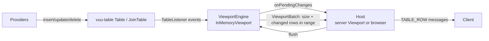

# Data engine: `@heswell/vuu-table` and `@heswell/vuu-viewport`

> For a detailed walkthrough of the internals (data structures, event
> handling, merge strategy, grouping, selection and the client diff), see
> [data-engine-internals.md](./data-engine-internals.md).

The core data management engine (tables plus viewport analytics: windowing,
sorting, filtering, grouping, selection, visual linking, permissioning and
joins) is split into two runtime-agnostic packages. They have no dependency on
Bun, Node or browser APIs, so the same code can run inside the Bun Vuu server
or inside a browser (the eventual replacement for vuu-ui's
`VuuModule`/`TickingArrayDataSource`).

| Package                 | Responsibility                                                                   |
| ----------------------- | -------------------------------------------------------------------------------- |
| `@heswell/vuu-table`    | Row store (`Table`), materialized left join (`JoinTable`), change notifications. |
| `@heswell/vuu-viewport` | `ViewportEngine` / `DataEngine` interfaces and the `InMemoryViewport` engine.    |

The legacy `@heswell/data` package (`DataView`, `RowSet`, `GroupRowSet`) is no
longer used by the server. It is retained only as the baseline for benchmarks.



## vuu-table

- `Table` stores rows as arrays (`VuuDataRow`) with a key → row index map.
  - Deletes are swap-remove, so they are O(1).
  - A parallel `seq` array records the insertion sequence. This gives a stable
    "natural" order that does not depend on physical row position.
- `insert` of an existing key is treated as an update. `update` sets
  `vuuUpdatedTimestamp` when the table has that column.
- Listeners are notified synchronously with `(type, rowIdx, row, previous)`.
  Listeners are always notified, even when `emitEvent=false`.
- `JoinTable` is a materialized left outer join of a base table and a right
  table on `left`/`right` columns.
  - It listens to both tables and maintains its own rows.
  - A tick on either side produces an update on the joined row(s), so
    viewports over a join table are ordinary viewports.
- `RowSource` is the read-only interface engines consume. Anything
  implementing it can be viewed.

## vuu-viewport

### Interfaces: the swap point

```ts
interface DataEngine {
  name: string;
  createViewport(table: RowSource, options: ViewportOptions): ViewportEngine;
}
```

`ViewportEngine` exposes:

- `flush`, `getCurrentRange`, `setRange` and `setConfig` (columns, sort,
  filterSpec, groupBy, aggregations).
- `setPermissionFilter` and `setLinkFilter`.
- Tree open and close.
- Selection.
- `getSelectedValues` / `getSelectedRowKeys` (for visual links).
- `getUniqueValues` (typeahead).

Every mutating call returns a `ViewportBatch` (`{size, sizeChanged, rows}`)
containing only rows in range that changed since last sent.

The server selects the engine with `setDefaultDataEngine(engine)` (in
`vuu-server/src/viewport/Viewport.ts`), or per viewport through the
`Viewport` constructor. An alternative implementation, such as DuckDB, needs
only to implement `DataEngine`/`ViewportEngine`.

### InMemoryViewport

- The filtered, sorted row set is an `Int32Array` of table row indices.
- Filters are compiled once (from the filter AST of `@vuu-ui/vuu-filter-parser`)
  into a closure over column indices. Permission and link filters are
  combined with the client filter into one predicate.
- Sorting extracts each sort column into a dense `Float64Array` key, with
  strings rank encoded, then sorts the index with a numeric comparator. The
  order is total (ties broken by insertion `seq`), so every row has exactly
  one position.
- Table events are **queued**, not applied immediately:
  - An update that does not touch a sort or filter column (or group/aggregate
    column) only marks the row dirty. This is O(1).
  - An insert, a delete, or an update that changes membership or sort position
    puts the row in a pending set. On flush, pending rows are removed. The
    survivors are then either:
    - binary-search inserted, when there are few pending rows relative to
      the index, or
    - sorted and linearly merged into the index.
  - `onPendingChanges` fires at most once between flushes. The host decides
    when to flush.
- Grouping (`GroupTree`) builds nodes keyed `$root|v1|v2…`.
  - Each node holds its child nodes or leaf rows plus incrementally
    maintained aggregates (Sum, Average, Count, High, Low, Distinct).
  - Ticks on aggregated columns update aggregates along the path without
    rebuilding the tree.
  - Only expanded nodes are flattened into the visible list.

### Protocol mapping

- Flat rows: `data` is the projected columns, and `rowKey` is the table key.
- Group rows: `data` is `[depth, isExpanded, treeKey, isLeaf, label, childCount,
...columns]`. Columns hold the group value (for groupBy columns) or the
  aggregate. Leaf rows in a grouped viewport use the same prefix. Their
  `rowKey`/`treeKey` is `parentTreeKey|tableKey`.
- `sel` is materialized into each `ViewportRow`.

## Server integration (`packages/vuu-server`)

- `viewport/Viewport.ts` wraps a `ViewportEngine`.
  - Engine `onPendingChanges` adds the viewport to a module-level dirty set.
  - A single `setImmediate` flushes all dirty viewports, coalescing all ticks
    received in the same event loop turn.
  - Tests can call `flushViewports()` directly.
  - Batches are posted to the session's outbound queue as a SIZE update (when
    size changed) followed by ROW updates. The row data is materialized at
    flush time, so the send path no longer reads from the table.
- `CoreServerApiHandler` handles:
  - CREATE/CHANGE/REMOVE/ENABLE/DISABLE_VP and CHANGE_VP_RANGE.
  - SELECT_ROW, DESELECT_ROW, DESELECT_ALL and SELECT_ROW_RANGE.
  - OPEN_TREE_NODE and CLOSE_TREE_NODE.
  - CREATE_VISUAL_LINK and REMOVE_VISUAL_LINK.
- **Visual links**: when the parent viewport's selection changes, the parent's
  `getSelectedValues(parentColumn)` becomes the child's `setLinkFilter`. An
  empty selection removes the link filter. Removing the parent viewport
  removes its links.
- **Row permissions**: `Viewport.permissionFilter` (a `RowPredicate`) is pushed
  into the engine and ANDed with the client filter.
- **Joins**: `core/table/JoinTable.ts` extends the vuu-table `JoinTable` and is
  built from a `JoinTableDef`.
- **Typeahead**: the handler uses `viewport.getUniqueValues` (which respects
  the viewport filter) when the viewport is over the requested table.

## Hosting in the browser

Nothing in either package depends on the server. A browser data source
equivalent to `TickingArrayDataSource` would:

1. create a `Table` per module table and feed it from the simulated data
   generators;
2. create an `InMemoryViewport` per data source with
   `onPendingChanges: () => queueMicrotask(flush)` (or
   `requestAnimationFrame`);
3. translate `ViewportBatch` rows into the `DataSourceRow` format, using the
   same tree column prefix as above.

That work is the next phase. It is not part of this change.

## Benchmarks

`packages/benchmarks` runs the same scenarios against the legacy `DataView` and
the new engine, from the repo root:

```sh
bun run bench                       # 100k rows, legacy vs vuu-viewport
bun run bench:1m                    # 1M rows, vuu-viewport only
bun packages/benchmarks/src/run.ts --rows=250000 --iterations=5 \
  --engine=vuu-viewport --filter=sort --out=results.md
```

Results are in `packages/benchmarks/results/`. At 100k rows the new engine is:

- 2–8x faster to create, sort and filter views;
- 2–5 orders of magnitude faster for ticks, inserts and deletes, where the
  legacy DataView rescans or resorts on each event.

Legacy grouping no longer works (`GroupBy contains invalid column(s)`), so the
grouping scenarios have results only for the new engine.

## Known limitations

- A visual link is not refreshed when the parent row's link column value
  changes after selection. It is refreshed only when the selection changes.
- `Count` aggregation counts non-null values; it is not a distinct count (use
  `Distinct`).
- Re-sorting at 1M rows takes about 0.3–0.4s. That is acceptable for an
  interactive sort change, but a native or WASM engine could do better.
