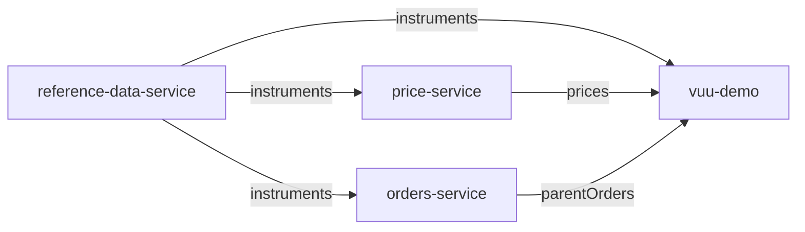

# Data services

The demo Vuu server (`vuu-demo`) consumes data from standalone data services:

| Service                  | Resource       | Default port | Depends on   |
| ------------------------ | -------------- | ------------ | ------------ |
| `reference-data-service` | `instruments`  | 8081         | –            |
| `price-service`          | `prices`       | 8082         | `instruments` |
| `orders-service`         | `parentOrders` | 8083         | `instruments` |

All of them are built on the publisher framework in
`packages/service-utils/src/publisher`.



## Building blocks

| Component                 | Role                                                                                                                                            |
| ------------------------- | ----------------------------------------------------------------------------------------------------------------------------------------------- |
| `TablePublisher`          | Publishes a `@heswell/vuu-table` `Table` as a resource. Listens to table changes, conflates them and sends snapshots and updates to subscribers. |
| `DataService`             | WebSocket + HTTP server (`Bun.serve`). Hosts publishers, generators and dependencies; heartbeats, flush timer, `/health` and `/admin` routes.   |
| `RemoteTableSubscription` | Resilient client. Replicates a remote resource into a local `Table`, reconnecting with exponential backoff and reconciling on resubscribe.      |
| `RateGenerator`           | Base class for synthetic data generators that produce N changes per second (drift-free, with bounded catch-up).                                 |

The services never block waiting for a dependency. A `DataService` starts
listening immediately. A `TablePublisher` created with `ready: false` accepts
subscriptions but holds back the snapshot until `setReady()` is called,
typically when the dependency's first snapshot arrives.

## Protocol

JSON text frames.

Client → server:

```jsonc
{ "type": "subscribe", "resource": "prices", "columns": ["ric", "bid"] } // snapshot then live updates
{ "type": "snapshot", "resource": "instruments" }                       // snapshot only, no live updates
{ "type": "unsubscribe", "resource": "prices" }
{ "type": "HB", "ts": 1700000000000 }                                     // reply to server heartbeat
```

`columns` is optional (defaults to all columns of the table). The legacy
request type `subscription` is accepted as an alias of `subscribe`.

Server → client:

```jsonc
{ "type": "snapshot-batch", "resource": "prices", "rows": [[...]], "isLast": false }
{ "type": "snapshot-count", "resource": "prices", "count": 228488 }  // snapshot complete
{ "type": "updates", "resource": "prices", "rows": [[...]] }        // inserts and updates, rows in requested column order
{ "type": "deletes", "resource": "prices", "keys": ["AAPL.OQ"] }
{ "type": "HB", "ts": 1700000000000 }
{ "type": "error", "resource": "prices", "message": "..." }
```

Snapshots are point-in-time: changes that happen while a snapshot is being
sent are queued and delivered as `updates` after `snapshot-count`. When a
table is cleared, subscribers receive a fresh snapshot.

## Resilience

- Every service, and `vuu-demo`, can be started in any order.
- `RemoteTableSubscription` reconnects with exponential backoff (250ms → 5s).
  While disconnected the local replica keeps its last known data.
- After a reconnect it subscribes again; rows absent from the new snapshot
  are deleted, so the replica is reconciled with the restarted source and
  downstream publishers propagate the inserts/updates/deletes.
- Missed heartbeats (30s) close the socket; protocol `error` messages trigger
  a reconnect.
- In `vuu-demo`, `RemoteProvider.load()` resolves immediately; the table is
  populated whenever the remote service becomes available. Set
  `waitForInitialSnapshot: true` in `remoteServiceDetails()` to restore
  blocking behaviour.

## Efficiency

Measured on 228,488 instruments:

| Metric                          | Before           | After            |
| ------------------------------- | ---------------- | ---------------- |
| Instruments snapshot            | 5.6s, 4571 msgs  | 0.13s, 230 msgs  |
| Prices snapshot                 | 3.1s             | 0.10s            |
| Live update cost                | 124 bytes/row    | 71 bytes/row     |
| price-service RSS               | ~520MB           | ~265MB           |

What changed:

- **Conflation.** Changes are recorded as dirty/deleted keys and flushed every
  100ms. A row that ticks 10 times between flushes is sent once.
- **Serialize once per projection.** Subscribers requesting the same columns
  share a projection group; each flush is `JSON.stringify`d once per group,
  not once per session.
- **Compact messages.** One `updates` message holding row arrays replaces
  per-row `{type, resource, row}` objects.
- **Large snapshot batches with backpressure.** 1000-row batches, pausing
  when the socket's buffered amount exceeds 1MB and resuming on drain.
  Sockets that exceed 16MB of backpressure are closed.
- **No queue without subscribers.** Previously updates queued while no one
  was connected (unbounded memory, and a large backlog for the first client).
- **No logging on the hot path.**
- **Shared rate generation.** `RateGenerator` replaces duplicated per-service
  timer code, and the generators mutate the `Table` directly.

### Compression

`DataService` can negotiate websocket permessage-deflate with clients that
support it, via the `compression` option or env `DATA_SERVICE_COMPRESSION=1`.
It is off by default. Measured on the wire (`perf/compression.perf.test.ts`):

| Metric                           | Off              | On               |
| -------------------------------- | ---------------- | ---------------- |
| Instruments snapshot             | 98 B/row, 0.14s  | 14 B/row, 0.37s  |
| Prices snapshot                  | 70 B/row         | 19 B/row         |
| Live price updates               | 70 B/row         | 21 B/row         |
| Flush 10k price updates (server) | ~7ms             | ~25ms            |

Compression cuts bandwidth 3-7x, but costs 2.5-3x in snapshot latency and
about 4x the server CPU per flush. Bun compresses each send per
socket, so the cost scales with the number of subscribers and is not shared
across a projection group. Turn it on for consumers on slow or metered
links, not on localhost or a fast LAN.

## Performance tests

`perf/*.perf.test.ts` measure the framework (synthetic, deterministic data)
and the real services (the 228k instruments data set), with and without
compression. Compressed sizes are measured on the wire by `WireTap`, a
byte-counting TCP proxy; `WireClient` sees only decompressed text. They run as part of
`bun test`, failing if a metric regresses against `perf/baseline.json`:

| Metric kind | Examples                                 | Tolerance                                   |
| ----------- | ---------------------------------------- | ------------------------------------------- |
| `time`      | snapshot time, flush time, startup time  | `PERF_TOLERANCE` x baseline + 25ms (default 3, 5 on CI) |
| `count`     | snapshot messages, rows sent, serializations | 10%                                     |
| `size`      | bytes per row                            | 10%                                         |

Timings are machine dependent, the baseline records the machine it came
from. Counts and sizes are the reliable regression signal.

`npm run perf` (`scripts/perf.ts`) runs the suite with 5 iterations per
timing (median) and prints a comparison table. Changes within run to run
noise (10% or 1ms for timings, 1% for counts and sizes) are shown as `≈`:

```sh
npm run perf                                # compare with perf/baseline.json
npm run perf -- --save /tmp/before.json     # save a run, e.g. on main
npm run perf -- --compare /tmp/before.json  # compare a branch with it
npm run perf -- --update-baseline           # accept current results
npm run perf -- --filter publisher          # run a subset
```

To add a metric, call the `record` function returned by `createRecorder()`
(`perf/harness.ts`) in a perf test, then update the baseline.

## Creating a new data publisher

A service is a table, a publisher and (optionally) a generator and
dependencies:

```ts
import {
  DataService,
  RateGenerator,
  RemoteTableSubscription,
  TablePublisher,
} from "@heswell/service-utils";
import { Table } from "@heswell/vuu-table";

class TradeGenerator extends RateGenerator {
  constructor(private trades: Table, private instruments: Table) {
    super({ name: "trades", rateParam: "tradesPerSecond" });
  }
  // called on each tick with the number of rows to produce
  protected generate(count: number) {
    for (let i = 0; i < count; i++) {
      this.trades.insert(makeTrade(this.instruments));
    }
  }
}

export function start() {
  const instruments = new Table({ schema: instrumentsSchema });
  const trades = new Table({ schema: tradesSchema });

  const publisher = new TablePublisher({ table: trades, ready: false });
  const generator = new TradeGenerator(trades, instruments);
  const refData = new RemoteTableSubscription({
    columns: ["ric"],
    resource: "instruments",
    table: instruments,
    url: "ws://localhost:8081",
  });

  new DataService({ name: "TRADES:service", port: 8084 })
    .addPublisher(publisher)
    .addGenerator(generator)
    .addDependency(refData)
    .start();

  refData.firstSnapshot.then(() => {
    publisher.setReady();
    generator.start(1000);
  });
}
```

A publisher without dependencies can omit the subscription and create the
`TablePublisher` with `ready: true` (the default). To consume the resource in
`vuu-demo`, add a `RemoteProvider`:

```ts
export class TradesProvider extends RemoteProvider {
  remoteServiceDetails() {
    return {
      resource: "trades",
      url: ConfigFactory.load().getString("services.trades.url"),
    };
  }
}
```

## Operations

HTTP routes on every `DataService` port:

| Route                                  | Description                                                             |
| -------------------------------------- | ----------------------------------------------------------------------- |
| `GET /health`                          | Sessions, publishers (ready, rows, subscribers), generators, dependencies |
| `GET /admin/start?generator=&rate=`    | Start / retune a generator. `generator` optional if only one; the generator's `rateParam` (e.g. `updatesPerSecond`) is also accepted. |
| `GET /admin/stop?generator=`           | Stop a generator                                                        |

Config keys (`application.conf`):

| Key                         | Service    | Default                |
| --------------------------- | ---------- | ---------------------- |
| `service.port`              | all        | required               |
| `services.refdata.url`      | prices, orders, demo | required     |
| `instruments.dataPath`      | refdata    | `data/instruments.ndjson` |
| `prices.updatesPerSecond`   | prices     | 10000                  |
| `orders.initialCount`       | orders     | 10000                  |
| `orders.newOrdersPerSecond` | orders     | 0                      |

Env `DATA_SERVICE_COMPRESSION=1` enables websocket compression on all services.

`scripts/start-all.ts` starts the services and the demo server concurrently.
