# HTTP services, authentication, and token management

## Purpose

This document describes the implemented HTTP, authentication, and token design
shared by:

- `@heswell/vuu-server`;
- `@heswell/vuu-portal`; and
- `@heswell/vuu-module-discovery`.

`vuu-server` provides the HTTPS and WebSocket infrastructure, reusable
authentication handler, Keycloak validation, token exchange, VUU login-token
service, and HTTP handler composition. Portal and module-discovery configure
and assemble those components for their respective applications.

The refactoring requirements are recorded in
`docs/requirements/vuu-server-authentication-refactoring.md`.

## Runtime architecture

```mermaid
flowchart LR
    Browser["Module-federation browser app"]
    Keycloak["Keycloak"]

    subgraph Portal["vuu-portal process"]
        PortalAuth["POST /api/authn<br/>configurable path"]
        PortalWs["VUU WebSocket"]
        PortalTokens["LoginTokenService"]
        PortalAdmin["Keycloak admin module"]
    end

    subgraph Discovery["vuu-module-discovery process"]
        DiscoveryAuth["POST /api/authn<br/>configurable path"]
        Registry["GET /module-registry"]
        DiscoveryWs["VUU WebSocket"]
        DiscoveryTokens["LoginTokenService"]
        RegistryTables["Module registry tables"]
    end

    Browser -->|"SSO"| Keycloak
    Keycloak -->|"Keycloak access token"| Browser

    Browser -->|"access token"| PortalAuth
    PortalAuth -->|"introspection"| Keycloak
    PortalAuth --> PortalTokens
    PortalTokens -->|"portal VUU token"| Browser
    Browser -->|"LOGIN"| PortalWs

    Browser -->|"access token"| DiscoveryAuth
    DiscoveryAuth -->|"introspection / token exchange"| Keycloak
    DiscoveryAuth --> DiscoveryTokens
    DiscoveryTokens -->|"discovery VUU token"| Browser
    Browser -->|"LOGIN"| DiscoveryWs

    Browser -->|"access token"| Registry
    Registry -->|"shared validation / exchange"| Keycloak
    Registry --> RegistryTables

    PortalAdmin -->|"admin access token"| Keycloak
```



The browser obtains a Keycloak access token through the module-federation
host's SSO integration. It exchanges that token independently with each VUU
server it needs to use. Each server returns a process-local VUU token for its
own WebSocket.

## HTTP infrastructure in `vuu-server`

### Server composition and lifecycle

`VuuServerConfig` combines:

- `VuuWebSocketOptions`;
- optional `HttpServerOptions`;
- one `LoginTokenService`; and
- registered VUU modules.

`VuuServer` always creates a `WebSocketServer`. It creates a `RestServer` when
`HttpServerOptions.requestHandler` is configured. Both listeners participate in
the same lifecycle.

The HTTPS and WebSocket listeners are separate `Bun.serve` instances. They may
use different ports but share certificate and key settings from
`VuuWebSocketOptions`.

### HTTPS dispatch and handler composition

`RestServer`:

1. requires TLS;
2. reads the configured certificate and key;
3. listens on `HttpServerOptions.httpsPort`, defaulting to `8443`;
4. delegates requests to the configured `HttpRequestHandler`; and
5. returns `404` when the handler returns `undefined`.

`composeHttpHandlers` supplies deterministic route composition. It invokes
handlers in order and returns the first defined response. This lets every
application combine shared authentication with its own endpoints without
duplicating either the HTTPS listener or authentication implementation.

### Configurable authentication endpoint

`createAuthHttpHandler` owns the authentication endpoint. Its path comes from
`vuu.auth.path` and defaults to `/api/authn`.

The path is validated when the handler is created. It must:

- begin with `/`;
- contain more than the root slash;
- omit a trailing slash;
- omit a query string and fragment; and
- be a path rather than an absolute URL.

When an application configures another path, `/api/authn` is no longer handled
unless another handler explicitly owns it.

## Shared authentication HTTP contract

| Method | Configured authentication path | Result |
| --- | --- | --- |
| `POST` | Yes | Authenticate and return a VUU login token |
| `OPTIONS` | Yes | CORS preflight |
| Other | Yes | `405` |
| Any | No | `undefined`, resulting in `404` if no later handler responds |

### Keycloak access-token request

Production callers send:

```http
POST /api/authn HTTP/1.1
Authorization: Bearer <keycloak-access-token>
```

The standard bearer syntax is preferred. The parser currently retains support
for the legacy `Bearer:` spelling.

### Demo credential request

When an application explicitly installs a credential provider, it can accept:

```http
POST /api/authn HTTP/1.1
Content-Type: application/json

{
  "username": "demo",
  "password": "demo"
}
```

Credentials are plain text within the HTTP message and rely on mandatory HTTPS
for transport protection. They are not included in responses or logs.

An `Authorization` header always selects bearer authentication. Invalid bearer
authentication never falls back to submitted credentials.

### Successful response

```http
HTTP/1.1 200 OK
Content-Type: application/json
Cache-Control: no-cache, no-store, max-age=0, must-revalidate
vuu-auth-token: <vuu-token>

{
  "token": "<vuu-token>"
}
```

The response body and compatibility header contain the same token. CORS exposes
the header to the configured browser origin.

### Failures

| Status | Condition |
| --- | --- |
| `400` | Malformed JSON |
| `401` | Missing, unsupported, invalid, inactive, expired, or incorrectly scoped authentication |
| `405` | Unsupported method |
| `500` | VUU login-token issuance fails |
| `503` | Keycloak validation or exchange is unavailable |

External errors are generic. Tokens, passwords, secrets, provider response
bodies, and internal error details are not returned.

## Authentication provider model

The shared provider model separates two capabilities:

- `BearerTokenAuthProvider` validates an identity-provider bearer token; and
- `CredentialAuthProvider` validates username/password credentials.

`AuthenticationProviders` allows an application to install either or both.
`KeycloakAuthProvider` is bearer-only. `PermissiveAuthProvider` is
credential-only. This prevents Keycloak mode from silently accepting posted
user credentials and keeps demo authentication independent from Keycloak.

## Keycloak validation and token exchange

### Configuration

Each VUU application supplies independent Keycloak settings:

| Setting | Purpose |
| --- | --- |
| `vuu.keycloak.url` | Keycloak base URL |
| `vuu.keycloak.realm` | User realm |
| `vuu.auth.keycloak.clientId` | Confidential client representing this VUU server |
| `vuu.auth.keycloak.clientSecret` | Client secret used for introspection and exchange |
| `vuu.auth.keycloak.audience` | Required or requested audience; defaults to client ID |
| `vuu.auth.keycloak.audiencePolicy` | `require-audience`, `exchange-if-needed`, or `always-exchange` |
| `vuu.auth.keycloak.tokenExchangeEnabled` | Explicitly enables token exchange |
| `vuu.keycloak.allowSelfSignedCert` | Local-development TLS override |

Exchange policies fail during startup unless exchange is enabled. Token
exchange also requires a client secret.

### Introspection

`KeycloakAuthProvider` never creates a `VuuUser` by decoding an unvalidated
JWT. It submits the incoming token to Keycloak's introspection endpoint using
the server's client credentials.

Validation requires:

- `active: true`;
- `preferred_username` or `username`;
- an `exp` value later than the current time; and
- the configured audience, subject to the selected policy.

The resulting authorization set is de-duplicated from:

- realm roles;
- roles for this server's configured client ID; and
- groups.

### Audience policies

| Policy | Behavior |
| --- | --- |
| `require-audience` | Reject an incoming token that lacks the configured audience |
| `exchange-if-needed` | Use a correctly scoped token; otherwise exchange it |
| `always-exchange` | Exchange every incoming token |

Portal is configured with `require-audience`. Module-discovery is configured
with `exchange-if-needed` and its own client ID.

### Token exchange

When exchange is required, the provider submits an OAuth 2.0 token-exchange
request to Keycloak. The request identifies:

- the incoming access token as `subject_token`;
- the requested token type as an access token;
- the server client as `client_id`; and
- the configured server audience.

The exchanged token is introspected again. Its identity, expiry, and audience
must pass the same validation before a VUU token can be issued. Exchange errors
fail closed; the provider does not fall back to the unscoped token.

Incoming and exchanged Keycloak tokens exist only during the request. They are
not returned or stored in `LoginTokenService`.

## VUU login tokens and WebSocket sessions

Each application creates one `LoginTokenService` and passes the same instance
to:

- its authentication HTTP handler; and
- `VuuServerConfig`, which supplies it to WebSocket `RequestProcessor`.

`LoginTokenService`:

1. serializes the validated `VuuUser` as base64url JSON;
2. signs the payload with HMAC-SHA-256 using a random process-local key;
3. stores the exact token and user in an in-memory map; and
4. validates signature, map membership, and user expiry during WebSocket
   `LOGIN`.

A successful login creates a VUU session and attaches the `VuuUser` to its
request handler. Subsequent `RequestContext` objects carry the username and
authorizations.

Consequences:

- portal and remote VUU tokens are distinct;
- a token works only in its issuing process;
- restart invalidates all issued tokens;
- the signed payload is readable but cannot be modified undetected;
- Keycloak expiry bounds the VUU token's useful lifetime; and
- established sessions are not currently terminated when that expiry later
  passes.

## Portal

`PortalMain` installs the shared authentication handler using
`vuu.auth.path`. It passes the same `LoginTokenService` to the handler and
portal WebSocket.

`createAuthProvider` selects:

| `vuu.auth.mode` | Installed capability |
| --- | --- |
| `keycloak` | `KeycloakAuthProvider` bearer authentication |
| `permissive` | `PermissiveAuthProvider` credential authentication |

Keycloak is the default. Permissive mode exists only for Keycloak-free demos.
It can restrict access to comma-separated `username:password` entries from
`vuu.auth.permissive.users`; an empty list accepts any non-empty pair.
Keycloak failure does not activate permissive mode.

The portal's Keycloak administration module has a separate server-to-server
token. `KeycloakAdminClient` obtains an admin access token from the configured
admin realm and uses it for Keycloak Admin API calls. That token is not a user
access token or VUU token and is never sent to the browser.

## Module discovery

`ModuleDiscoveryMain` creates:

- a `KeycloakAuthProvider` configured for module-discovery;
- one local `LoginTokenService`;
- the shared configurable authentication handler;
- the module-registry handler; and
- a composed HTTP handler containing both routes.

The module-discovery authentication endpoint validates or exchanges the host's
Keycloak access token, then issues a VUU token accepted by
module-discovery's WebSocket.

### Module registry

`GET /module-registry` remains a stateless Keycloak-protected endpoint. It calls
the same `authenticateBearerRequest` and `KeycloakAuthProvider` used by the
shared authentication handler, but it does not issue or accept a VUU token.

After authentication, it reads:

- `modules`;
- `modulePermissions`; and
- `moduleUsers`.

A module is visible when it is enabled and either:

- the validated username has a matching `moduleUsers` row; or
- a validated Keycloak authorization has a matching
  `modulePermissions.role` row.

For each module name, the endpoint selects the greatest accessible version and
uses the greatest ID to break equal-version ties. Results are sorted by name.

## Transport and CORS

The REST server refuses to start without TLS. WebSocket TLS remains optional in
the reusable server options, although portal and module-discovery enable it in
their checked-in configurations.

Both HTTP handlers use the configured `vuu.auth.cors.allowedOrigin`.
Matching configured origins receive credential and `Vary: Origin` headers.
CORS is a browser policy, not an authentication mechanism; Keycloak validation
remains the service security boundary.

`vuu.keycloak.allowSelfSignedCert=true` disables Keycloak certificate
verification and is for local development only.

## Current security boundaries

1. **Process-local tokens require affinity.** Horizontal scaling needs sticky
   routing or a redesigned shared/verifiable VUU token service.
2. **Session identity is checked at login.** Existing WebSocket sessions do not
   continuously revalidate Keycloak state or expiry.
3. **Portal admin RPC authorization remains separate work.** The shared
   authentication refactor carries authorizations into request contexts but
   does not itself add role checks to privileged RPCs.
4. **Registry policy is endpoint-specific.** Its module filtering does not
   automatically authorize all module-discovery VUU table or edit operations.
5. **Deployment secrets must be protected.** Production client and admin
   secrets belong in protected deployment configuration, not source control.
6. **Token exchange depends on Keycloak policy.** The realm must permit the
   configured client to exchange the host token for the requested audience.

## Implementation map

| Responsibility | Implementation |
| --- | --- |
| VUU server lifecycle | `packages/vuu-server/src/core/VuuServer.ts` |
| HTTPS listener | `packages/vuu-server/src/net/http/RestServer.ts` |
| HTTP composition | `packages/vuu-server/src/net/http/composeHttpHandlers.ts` |
| Authentication endpoint | `packages/vuu-server/src/net/auth/AuthHttpHandler.ts` |
| Shared bearer request validation | `packages/vuu-server/src/net/auth/BearerTokenAuthentication.ts` |
| Authentication errors | `packages/vuu-server/src/net/auth/AuthenticationErrors.ts` |
| Provider capabilities | `packages/vuu-server/src/net/auth/AuthProvider.ts` |
| Keycloak introspection and exchange | `packages/vuu-server/src/net/auth/KeycloakAuthProvider.ts` |
| VUU login tokens | `packages/vuu-server/src/net/auth/LoginTokenService.ts` |
| WebSocket login | `packages/vuu-server/src/net/RequestProcessor.ts` |
| Portal wiring | `packages/vuu-portal/src/PortalMain.ts` |
| Portal provider selection | `packages/vuu-portal/src/auth/createAuthProvider.ts` |
| Module-discovery wiring | `packages/vuu-module-discovery/src/ModuleDiscoveryMain.ts` |
| Module registry | `packages/vuu-module-discovery/src/ModuleRegistryHandler.ts` |
