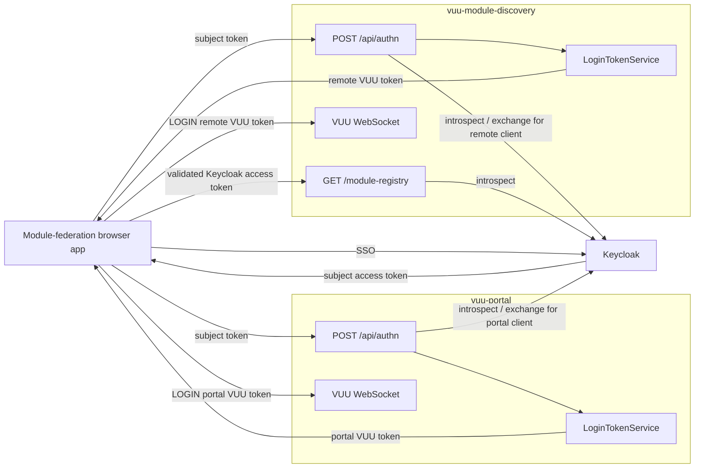

# Specification: shared VUU server authentication

## 1. Purpose

Refactor VUU HTTP authentication so every `VuuServer` application can expose a
shared `/api/authn` endpoint that exchanges an authenticated identity for a
process-local VUU login token.

This specification covers:

- reusable authentication support in `@heswell/vuu-server`;
- Keycloak SSO integration for `@heswell/vuu-portal`;
- Keycloak SSO integration for remote-module servers, using
  `@heswell/vuu-module-discovery` as the reference implementation;
- optional username/password authentication for portal demonstrations; and
- composition of shared authentication routes with application-specific HTTP
  routes.

The existing implementation is described in
`docs/design/http-services-authentication.md`. This specification defines the
target behaviour and supersedes that document where the two differ.

## 2. Goals

1. Every VUU server application can install the same authentication endpoint
   implementation, defaulting to `/api/authn`.
2. A Keycloak access token is validated with Keycloak before a VUU token is
   issued.
3. Each server can use its own Keycloak client ID and client secret.
4. A remote server can obtain a Keycloak token scoped to its own client before
   issuing its VUU token.
5. The portal can optionally accept username/password credentials for
   Keycloak-free demonstrations.
6. Application-specific endpoints, such as `/module-registry`, can coexist
   with `/api/authn` without duplicating authentication logic.
7. The HTTP authentication service and WebSocket server use the same
   `LoginTokenService`, so a token issued by one VUU process is accepted by that
   process's WebSocket service.

## 3. Non-goals

- Implementing browser redirects, authorization-code flow, PKCE, or the
  Keycloak login user interface.
- Sharing a VUU login token between different VUU server processes.
- Replacing Keycloak as the production identity provider.
- Defining authorization policy for every VUU table or RPC.
- Sending username/password credentials to remote-module servers.
- Persisting VUU login tokens or making them portable across replicas.

## 4. Terminology

| Term | Meaning |
| --- | --- |
| Host | The module-federation host application backed by `vuu-portal` |
| Remote | A module-federation remote application backed by another VUU server, exemplified by `vuu-module-discovery` |
| Subject token | The Keycloak access token originally obtained by the host through SSO |
| Client-scoped token | A Keycloak access token issued for, or with the required audience of, a particular VUU server client |
| VUU login token | A token issued by a VUU process and consumed by that same process during WebSocket `LOGIN` |
| Token validation | Server-to-server validation with Keycloak, using token introspection |
| Token exchange | Keycloak's token-exchange operation used to obtain a client-scoped access token from a subject token |

An OpenID Connect ID token is not an API access token. Clients MUST send a
Keycloak access token to `/api/authn`. If an existing host currently exposes
only an ID token, the host's Keycloak integration MUST first obtain an access
token suitable for token exchange.

## 5. Target architecture



Each VUU server issues its own VUU login token. The browser performs a separate
`/api/authn` exchange with every VUU server whose WebSocket it needs to use.

## 6. Shared `/api/authn` contract

### 6.1 Endpoint

All participating VUU servers MUST expose an authentication endpoint. Its path
MUST be configurable in `application.conf` and MUST default to:

```text
POST /api/authn
```

The endpoint MUST be served over HTTPS.

The configured value MUST be an absolute URL path beginning with `/`. It MUST
NOT contain a scheme, host, query string, or fragment. A trailing slash policy
MUST be applied consistently; the recommended behaviour is to reject a
trailing slash other than the root path during configuration validation.

All references to `/api/authn` in this specification mean the configured
authentication path, whose default value is `/api/authn`.

The endpoint supports two authentication inputs:

| Input | Availability | Request form |
| --- | --- | --- |
| Keycloak access token | All production VUU servers | `Authorization: Bearer <access-token>` |
| Username/password | Portal demo mode only | JSON request body |

The standard `Bearer` syntax MUST be documented and used by new clients.
Support for the existing non-standard `Bearer:` spelling MAY be retained
temporarily for compatibility, but SHOULD be deprecated.

### 6.2 Keycloak request

```http
POST /api/authn HTTP/1.1
Authorization: Bearer <keycloak-access-token>
Content-Type: application/json
```

No request body is required.

### 6.3 Demo credential request

```http
POST /api/authn HTTP/1.1
Content-Type: application/json

{
  "username": "demo",
  "password": "demo"
}
```

Credentials are plain text at the HTTP message layer and therefore MUST be
protected by TLS. They MUST NOT be logged, persisted, included in errors, or
forwarded to any service other than the configured demo authenticator.

### 6.4 Successful response

```http
HTTP/1.1 200 OK
Content-Type: application/json
Cache-Control: no-cache, no-store, max-age=0, must-revalidate
vuu-auth-token: <vuu-login-token>

{
  "token": "<vuu-login-token>"
}
```

The body is the normative response. The `vuu-auth-token` header MUST remain
available during migration for existing clients.

### 6.5 Error responses

| Status | Meaning |
| --- | --- |
| `400` | Malformed JSON or unsupported authentication input shape |
| `401` | Missing credentials, invalid credentials, failed token validation, inactive token, or expired token |
| `405` | Unsupported HTTP method |
| `500` | VUU token issuance or unexpected internal failure |
| `502` or `503` | Keycloak cannot complete validation or exchange |

Authentication failures MUST use a generic external message and MUST NOT expose
tokens, credentials, client secrets, Keycloak response bodies, or stack traces.
Operational logs MAY distinguish unavailable Keycloak from invalid
authentication, but MUST NOT contain secret values.

`OPTIONS /api/authn` MUST continue to provide CORS preflight support.

## 7. Keycloak authentication flow

### 7.1 Required validation

A VUU server MUST NOT parse an unvalidated JWT and issue a VUU token from its
claims.

For every incoming Keycloak token, the shared authentication implementation
MUST:

1. parse the `Authorization` header;
2. submit the token to Keycloak's introspection endpoint using that server's
   configured client credentials;
3. require `active: true`;
4. require a username from `preferred_username`, falling back to `username`;
5. require an `exp` value later than the current time; and
6. construct a `VuuUser` only after all checks pass.

The `VuuUser.authorizations` list MUST be de-duplicated and include:

- realm roles from `realm_access.roles`;
- roles for the VUU server's configured client from
  `resource_access[clientId].roles`; and
- Keycloak groups.

### 7.2 Client and audience handling

Every VUU server has independent Keycloak client configuration:

```text
vuu.auth.keycloak.clientId
vuu.auth.keycloak.clientSecret
```

After introspection, the server MUST determine whether the supplied token is
acceptable for that server's client. Acceptance MUST be based on configured
audience/client policy, not merely on the token being active.

The shared implementation MUST support these policies:

| Policy | Behaviour |
| --- | --- |
| `require-audience` | Reject unless the incoming token contains the configured server client as an audience |
| `exchange-if-needed` | Use the incoming token when correctly scoped; otherwise exchange it for a token scoped to the server client |
| `always-exchange` | Always perform token exchange and use the resulting token claims |

Production defaults SHOULD be `exchange-if-needed` for both portal and
remote-module servers, with per-server client IDs and audiences.

### 7.3 Token exchange for a remote client

When exchange is required, the server MUST call the Keycloak token endpoint
using OAuth 2.0 token exchange:

```text
grant_type=urn:ietf:params:oauth:grant-type:token-exchange
subject_token=<incoming-access-token>
subject_token_type=urn:ietf:params:oauth:token-type:access_token
requested_token_type=urn:ietf:params:oauth:token-type:access_token
audience=<server-client-id>
client_id=<server-client-id>
client_secret=<server-client-secret>
```

The exact Keycloak audience or requested-subject configuration MAY be made
configurable to accommodate the deployed Keycloak version and realm policy.

The exchanged access token MUST be validated before its claims are used. This
MAY be satisfied by introspecting the exchanged token and applying the same
active, username, expiry, and audience checks as the original token.

Token exchange failures MUST fail closed. The server MUST NOT fall back to the
unscoped subject token when policy requires exchange.

The subject and exchanged Keycloak tokens MUST be held only for the duration of
the request. Neither token is stored in `LoginTokenService` or returned in the
response.

### 7.4 Keycloak client topology and bootstrap

The realm bootstrap MUST support a shared public browser client plus multiple
confidential server clients.

Minimum local topology:

- public client: `vuu-portal`;
- confidential client: `vuu-portal-server`; and
- confidential client: `vuu-module-discovery-server`.

The bootstrap process MUST be extensible so additional server clients can be
added without duplicating client-creation logic.

For each confidential server client, bootstrap MUST:

- create the client when missing (or update when present);
- enable standard token exchange (`standard.token.exchange.enabled=true`);
- keep the client confidential with service-account capability; and
- retrieve or rotate the client secret via Keycloak Admin API as needed.

For the public `vuu-portal` client, bootstrap MUST ensure every configured
server client is included in access-token audience via audience protocol
mappers. This allows each backend server client to exchange the subject token
for its own scoped token under `exchange-if-needed`.

### 7.5 Resulting VUU identity

The VUU login token MUST be issued from the validated claims of:

- the incoming token when it satisfies the server's client policy; or
- the exchanged, client-scoped token when exchange occurs.

The `VuuUser.expiry` MUST NOT exceed the expiry of the Keycloak token whose
claims were used. The shared implementation MUST NOT extend a Keycloak
identity's lifetime by issuing a longer-lived VUU token.

## 8. VUU login token and WebSocket flow

The HTTPS handler and `RequestProcessor` for a given VUU server MUST receive the
same `LoginTokenService` instance.

After `/api/authn` returns:

1. the client opens that server's VUU WebSocket;
2. the client sends a VUU `LOGIN` message containing the returned VUU token;
3. `LoginTokenService.login` validates the token and expiry;
4. `RequestProcessor` creates a session associated with the `VuuUser`; and
5. subsequent request contexts carry that user and its authorizations.

A VUU token:

- is valid only in the VUU server process that issued it;
- MUST NOT be accepted as a Keycloak token by another `/api/authn` endpoint;
- MUST be rejected after its embedded user expiry; and
- MUST never be logged.

The existing HMAC-signed, in-memory implementation MAY be retained by this
refactoring. Persistence, cross-replica use, revocation, and continuous session
expiry are separate concerns.

## 9. Portal requirements

### 9.1 SSO flow

The module-federation host owns the browser-facing Keycloak SSO flow. After
Keycloak authenticates the user, the host:

1. obtains a Keycloak access token;
2. sends it to the portal's `POST /api/authn`;
3. receives the portal's VUU login token; and
4. uses that VUU token for the portal WebSocket `LOGIN`.

The portal MUST validate the access token with Keycloak before issuing its VUU
token. It MUST apply its configured audience policy.

### 9.2 Demo username/password mode

The portal MUST additionally support a Keycloak-free demo mode.

Demo mode requirements:

- it is disabled by default in production configuration;
- it is enabled by an explicit authentication-mode setting;
- it accepts only `POST` JSON username/password requests over HTTPS;
- it uses `PermissiveAuthProvider` or a replacement demo provider;
- an optional configured user list can restrict accepted pairs;
- an empty configured list MAY accept any non-empty pair for local demos;
- demo users receive no Keycloak roles or groups; and
- demo authentication MUST NOT silently activate when Keycloak is
  unavailable.

The portal MAY support Keycloak and demo credentials concurrently only when an
explicit `keycloak-with-demo-fallback` mode is configured. "Fallback" means
selecting the provider from the request input, not retrying invalid Keycloak
authentication as a demo login.

## 10. Module-discovery requirements

### 10.1 Shared authentication endpoint

`vuu-module-discovery` MUST install the shared `/api/authn` handler and use its
own `LoginTokenService`.

It MUST use module-discovery's Keycloak client ID, secret, audience policy, and
optional token-exchange configuration. These values need not match the portal
client.

It MUST NOT support demo username/password authentication by default.

After authenticating with `/api/authn`, a remote-module client can establish a
VUU WebSocket session with the module-discovery VUU token.

### 10.2 Module registry endpoint

`GET /module-registry` remains an application-specific endpoint.

It MUST:

- require a validated Keycloak access token;
- use the shared Keycloak token parsing, introspection, exchange, claim
  extraction, expiry, and error-mapping components;
- apply module-discovery's client/audience policy;
- authorize modules from the validated `VuuUser.name` and
  `VuuUser.authorizations`; and
- retain the existing enabled-module filtering and version-selection rules.

The registry endpoint MUST NOT require or accept a VUU login token as a
substitute for the Keycloak access token. This keeps its stateless HTTP
authorization independent from a WebSocket session.

The handler MAY use an internal shared function that returns a validated
`VuuUser`; it MUST NOT call `/api/authn` over HTTP or issue a VUU token merely
to authorize the registry request.

### 10.3 Route composition

`vuu-module-discovery` MUST compose at least two handlers:

1. shared `/api/authn`; and
2. module-specific `/module-registry`.

The shared server package SHOULD provide a small deterministic router or
handler-composition function. It MUST:

- invoke handlers in configured order;
- return the first defined `Response`;
- return `undefined` only when no handler owns the path; and
- leave the final `404` response to `RestServer`.

Application code MUST NOT duplicate the `/api/authn` implementation to achieve
route composition. The composer MUST route the configured authentication path,
not assume that it is `/api/authn`.

## 11. Shared implementation design

The refactoring SHOULD separate these responsibilities:

| Component | Responsibility |
| --- | --- |
| `AuthHttpHandler` | `/api/authn` HTTP contract, input selection, CORS, response mapping, VUU token issuance |
| `KeycloakAuthProvider` | Introspection, audience validation, optional token exchange, validated claim extraction |
| `PermissiveAuthProvider` | Explicit demo-only username/password validation |
| `LoginTokenService` | VUU token creation and WebSocket-login validation |
| HTTP handler composer/router | Combine shared and application-specific routes |
| Application main | Configuration, provider policy, handler composition, and shared service wiring |

`AuthProvider` SHOULD expose capabilities explicitly rather than relying on an
optional method to infer configuration. The implementation MAY introduce
separate interfaces for credential authentication and bearer-token
authentication.

The Keycloak validation API SHOULD return a `VuuUser`, not raw token payloads,
so `/api/authn` and `/module-registry` cannot diverge in claim extraction or
expiry handling.

## 12. Configuration

The following target settings SHOULD be supported:

| Setting | Purpose |
| --- | --- |
| `vuu.auth.path` | Authentication endpoint path; defaults to `/api/authn` |
| `vuu.auth.mode` | `keycloak`, `permissive`, or explicit combined demo mode |
| `vuu.auth.cors.allowedOrigin` | Browser origin allowed to call authentication endpoints |
| `vuu.auth.keycloak.clientId` | Keycloak client representing this VUU server |
| `vuu.auth.keycloak.clientSecret` | Confidential-client secret |
| `vuu.auth.keycloak.audiencePolicy` | `require-audience`, `exchange-if-needed`, or `always-exchange` |
| `vuu.auth.keycloak.audience` | Expected/requested audience; defaults to client ID |
| `vuu.auth.keycloak.tokenExchangeEnabled` | Explicit deployment control for token exchange |
| `vuu.auth.permissive.users` | Demo `username:password` pairs |
| `vuu.keycloak.url` | Keycloak base URL |
| `vuu.keycloak.realm` | User realm |
| `vuu.keycloak.allowSelfSignedCert` | Local-development TLS override only |

Secrets MUST be supplied through protected deployment configuration or
environment variables. Checked-in configuration MUST contain placeholders or
local-only values that are not usable deployment credentials.

Startup MUST fail with a clear configuration error when:

- Keycloak mode lacks required client configuration;
- an exchange policy is selected but exchange is disabled or lacks a required
  confidential-client secret;
- an unknown authentication or audience policy is configured; or
- `vuu.auth.path` is not a valid absolute URL path; or
- demo mode is selected where the application has explicitly prohibited it.

## 13. Migration plan

1. Extend `KeycloakAuthProvider` with expiry checks, audience policy, and
   optional token exchange.
2. Refine the shared provider interfaces so bearer and credential capabilities
   are explicit.
3. Retain and harden the shared `AuthHttpHandler`.
4. Add handler composition to `vuu-server`.
5. Keep `vuu-portal` on the shared handler and make its demo credential mode
   explicit.
6. Install the shared handler in `vuu-module-discovery` alongside the registry
   handler.
7. Refactor the registry handler to call the shared Keycloak validation API.
8. Update sample configuration and client integration documentation.
9. Deprecate `GET /api/authn` and non-standard `Bearer:` syntax if compatibility
   requires retaining them temporarily.

During migration, the public VUU WebSocket protocol and the successful
`/api/authn` response shape MUST remain compatible.

## 14. Test requirements

### 14.1 Shared authentication tests

- valid, correctly scoped Keycloak token produces a VUU token;
- inactive, expired, malformed, and failed-to-introspect tokens return `401`;
- a token with the wrong audience is rejected under `require-audience`;
- a wrong-audience token is exchanged under `exchange-if-needed`;
- an exchanged token is introspected and its claims are used;
- failed exchange does not fall back to the subject token;
- VUU token expiry does not exceed Keycloak expiry;
- credentials are ignored when an `Authorization` header is present;
- no token or credential appears in an error response;
- the endpoint uses `/api/authn` when no path is configured;
- a configured authentication path replaces `/api/authn`;
- the default path returns `404` when a different path is configured;
- invalid configured paths prevent startup;
- CORS preflight and successful response headers remain compatible; and
- the issued VUU token logs into the WebSocket backed by the same
  `LoginTokenService`.

### 14.2 Portal tests

- SSO access-token exchange succeeds in Keycloak mode;
- a fresh `vuu-portal` token includes every configured server client in `aud`;
- demo credentials succeed only in an explicitly enabled demo mode;
- demo credentials are rejected in Keycloak-only mode;
- invalid Keycloak authentication never falls back to permissive
  authentication; and
- portal-specific client and audience configuration is passed to the shared
  provider.

### 14.3 Module-discovery tests

- both `/api/authn` and `/module-registry` are reachable through the composed
  handler;
- an unrelated path returns `404`;
- module-discovery uses its own client ID and exchange policy;
- a subject token can be exchanged for a module-discovery-scoped token;
- the resulting VUU token logs into module-discovery's WebSocket;
- registry authorization uses the shared validated `VuuUser`;
- existing username, role, disabled-module, version, and tie-break rules remain
  unchanged; and
- username/password authentication is rejected.

### 14.4 Keycloak bootstrap script tests

- bootstrap creates or updates all configured confidential server clients;
- each server client has `standard.token.exchange.enabled=true`;
- `vuu-portal` has audience mappers for all configured server clients; and
- adding a new server client entry to the list produces the expected client and
   audience mapping without additional bespoke code.

## 15. Acceptance criteria

1. `vuu-portal` and `vuu-module-discovery` both expose the shared authentication
   endpoint, defaulting to `POST /api/authn`.
2. Both servers use the shared `vuu-server` authentication handler and
   Keycloak validation implementation.
3. No VUU token is issued from an unvalidated Keycloak token.
4. Each server can configure a distinct Keycloak client ID, secret, audience,
   and exchange policy.
5. Module discovery can exchange a host subject token for a token scoped to its
   own Keycloak client and validates the exchanged token.
6. A VUU token issued by each server authenticates only that server's
   WebSocket.
7. Portal demo username/password authentication works only when explicitly
   enabled and does not depend on Keycloak.
8. Module discovery composes `/api/authn` with `/module-registry` without
   copying authentication code.
9. `/module-registry` retains its existing authorization and module-selection
   behaviour while reusing shared Keycloak validation.
10. Authentication failures fail closed and do not expose or log credentials,
    access tokens, VUU tokens, or client secrets.
11. Each application can override the authentication endpoint with
    `vuu.auth.path` in `application.conf`; when omitted, the path is
    `/api/authn`.
12. Keycloak bootstrap creates a public portal client plus all configured
   confidential server clients, enables standard token exchange for each
   server client, and maps all server clients into portal token audiences.
